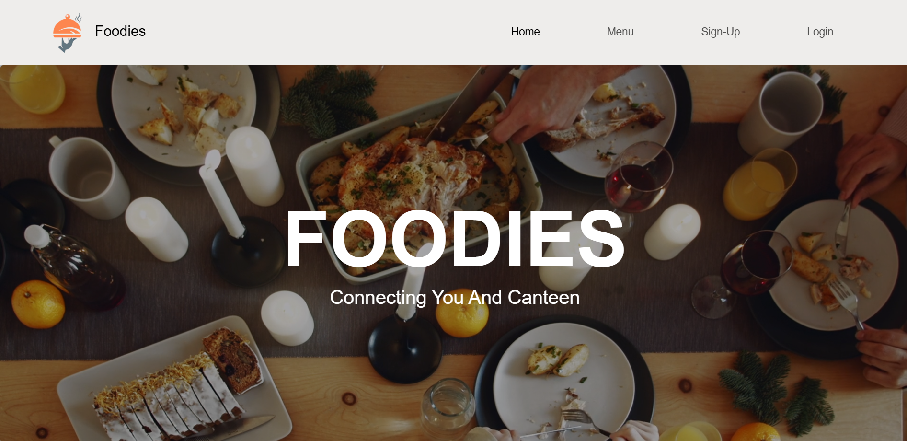
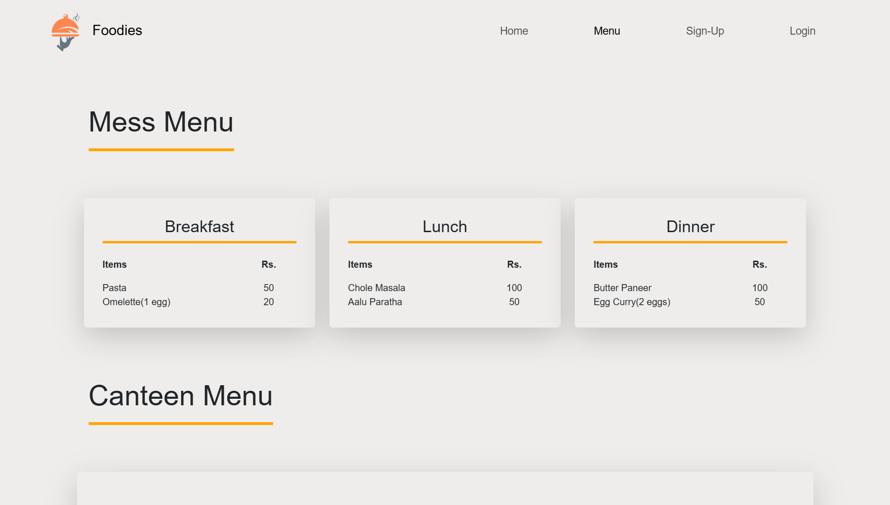
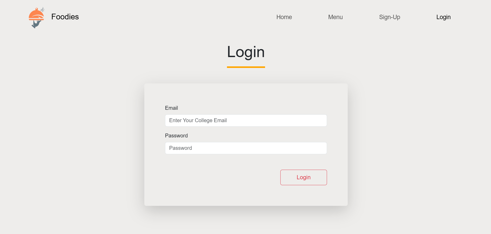
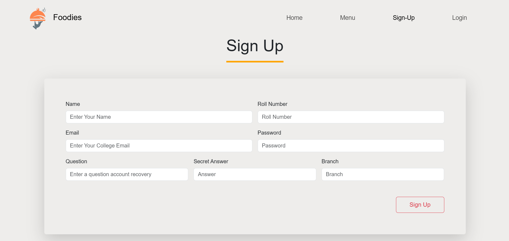

# 🍔 Foodies - A MERN Stack College Canteen Web App

**Foodies** is a full-stack web application for managing college canteen menus and feedback. Built using **MongoDB, Express.js, React, and Node.js (MERN)**.

## 📸 Screenshots








## ✨ Features
- 📜 View separate menus for hostelers and all users.
- ✍️ Leave and delete feedback.
- 🍽️ Canteen staff can upload/update menus and read feedback.
- 🔑 Admin panel for managing canteen staff and feedback.

## 🛠 Tech Stack
- **Frontend**: React
- **Backend**: Node.js, Express.js
- **Database**: MongoDB

## 🚀 Getting Started
Clone the repo and install dependencies:
```bash
git clone https://github.com/your-username/Foodies.git

# Install dependencies for the backend
cd Server
npm install

# Install dependencies for the frontend
cd Client
npm install

# Run Project
cd server
nodemon

cd Client
npm run dev
